# 🏦 Secure Digital Banking Management System

A full-stack digital banking web application built using **Java Spring Boot**, **JSP**, and **MySQL**, designed to provide secure banking operations, intelligent customer assistance, and real-time financial management features.

The system follows a layered MVC architecture and integrates modern technologies like AI chatbot support, Razorpay payment gateway, fraud detection, biometric security, OTP verification, and automated EMI reminder services.

---

## 🚀 Tech Stack

| Layer | Technology |
|-------|------------|
| Backend | Java 17, Spring Boot 3.2.4, Spring JDBC |
| Frontend | JSP, HTML5, CSS3, Bootstrap 5, JavaScript |
| Database | MySQL |
| Authentication | BCrypt Password Hashing, Session Management |
| SMS Service | Twilio API |
| Email Service | Spring Mail (Gmail SMTP) |
| AI Chatbot | OpenRouter API (Nemotron) |
| PDF Generation | iTextPDF |
| Payment Gateway | Razorpay |
| Build Tool | Maven |
| Containerization | Docker |
| Security | HMAC-SHA256, OTP Verification, Fraud Detection |

---

## 🧩 Architecture Highlights

- MVC architecture using Spring Boot + JSP
- Layered backend structure (Controller → Service → DAO)
- Secure session-based authentication system
- REST API integration with OpenRouter AI
- Automated email and SMS notification workflows
- Fraud detection and transaction monitoring
- Razorpay payment signature verification using HMAC-SHA256
- Responsive and user-friendly dashboard interface

---

## ✨ Key Features

### 👤 Authentication & Security
- User Registration and Login
- BCrypt password encryption
- OTP verification using Twilio SMS
- Session-based authentication
- Password reset via OTP email verification

### 🏦 Banking Operations
- Account creation with admin approval
- Deposit and withdrawal operations
- OTP-secured fund transfers
- Beneficiary management system
- Mini statement and transaction history
- PDF statement download using iTextPDF

### 💳 Razorpay Payment Integration
- Live Razorpay payment gateway integration
- Secure HMAC-SHA256 payment signature verification
- Real-time payment processing

### 🏷️ Loan Management
- Loan application system
- EMI calculation and tracking
- Automated EMI reminder emails using Spring Scheduler
- Loan approval management

### 🤖 AI Chatbot Assistant
- AI-powered banking chatbot using OpenRouter API
- Rule-based customer query assistance
- 24/7 banking support simulation

### 🛡️ Advanced Security Features
- Fraud Detection Engine
- Auto-flagging transactions above ₹50,000
- Rate limiting for suspicious activities
- Admin fraud monitoring dashboard
- Hidden Balance Vault with secure PIN protection
- WebAuthn biometric fingerprint authentication

### 🛠️ Admin Portal
- Customer account approval system
- User management dashboard
- Block/Unblock accounts
- FAQ management
- Active user monitoring
- Fraud alert review system

### 📊 Dashboard & Analytics
- Customer dashboard with account overview
- Real-time transaction tracking
- Payment history monitoring
- Responsive UI design

### 📄 Additional Features
- Docker support
- Email notifications
- SMS integration
- MVC architecture
- JDBC-based database operations

---

## 📂 Project Structure

```bash
src/
├── main/
│   ├── java/
│   │   └── com/example/online_banking_system
│   ├── resources/
│   └── webapp/
│       ├── WEB-INF/jsp/
│       ├── css/
│       ├── js/
│       └── images/
```

---

## 🛠️ Setup Instructions

### Prerequisites

- Java 17+
- MySQL 8+
- Maven 3.6+

### Installation

```bash
# Clone repository
git clone https://github.com/soubhagya-behera/secure_digital_banking_management_system.git

# Navigate to project
cd secure_digital_banking_management_system

# Create MySQL database
mysql -u root -p -e "CREATE DATABASE digital_banking;"

# Configure database credentials
# Update src/main/resources/application.properties

# Run the application
./mvnw spring-boot:run
```

---

## 🌐 Application Access

Open the application in your browser:

```bash
http://localhost:8082
```

---

## 🔐 Security Features

- BCrypt password hashing
- Session-based authentication
- OTP verification via SMS
- Fraud detection and suspicious activity monitoring
- HMAC-SHA256 payment signature verification
- Secure database credential management
- Biometric authentication support
- Protected banking operations

---

## 📸 Screenshots

### Project Opening Page UI

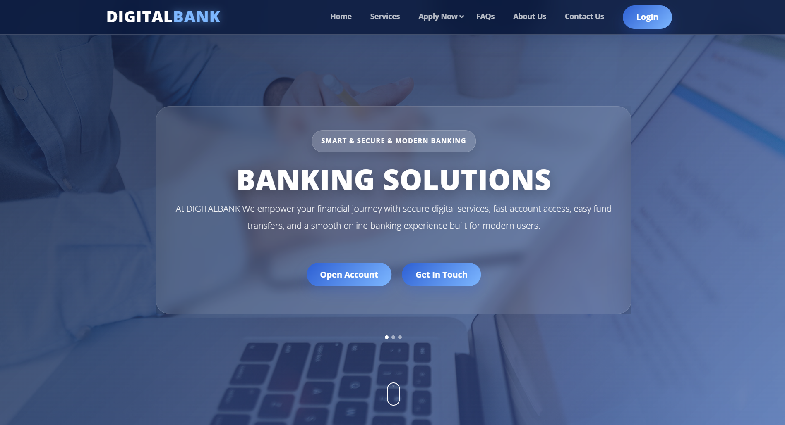

---

### Login Page


---

### Customer Dashboard

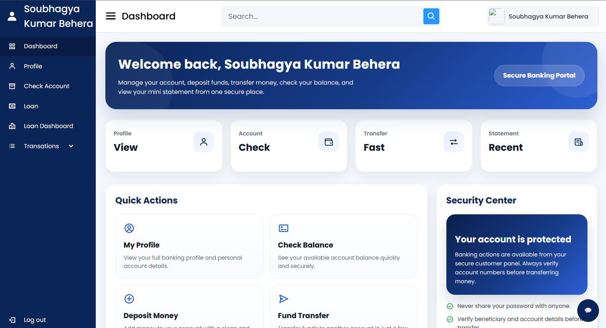

---

### Loan Management

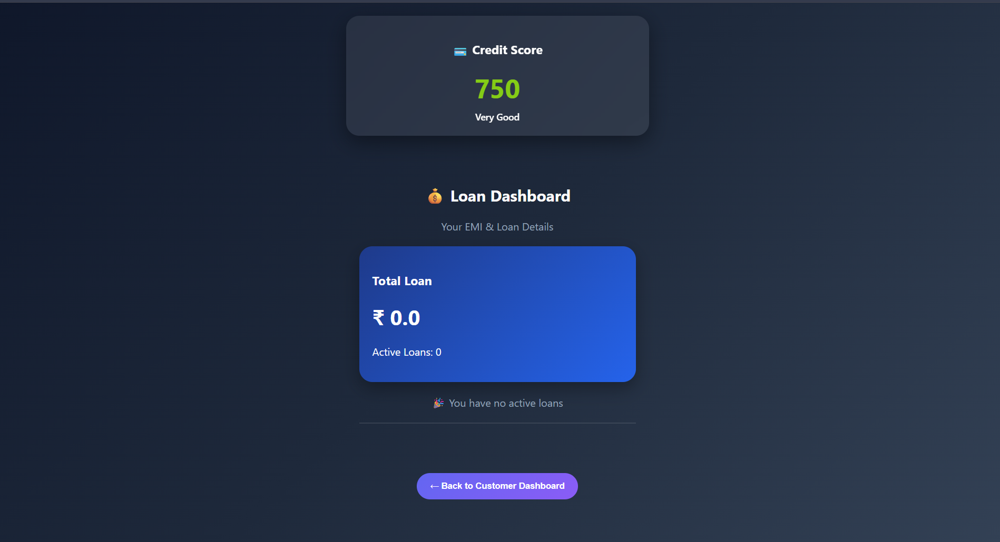

---

### Admin Panel

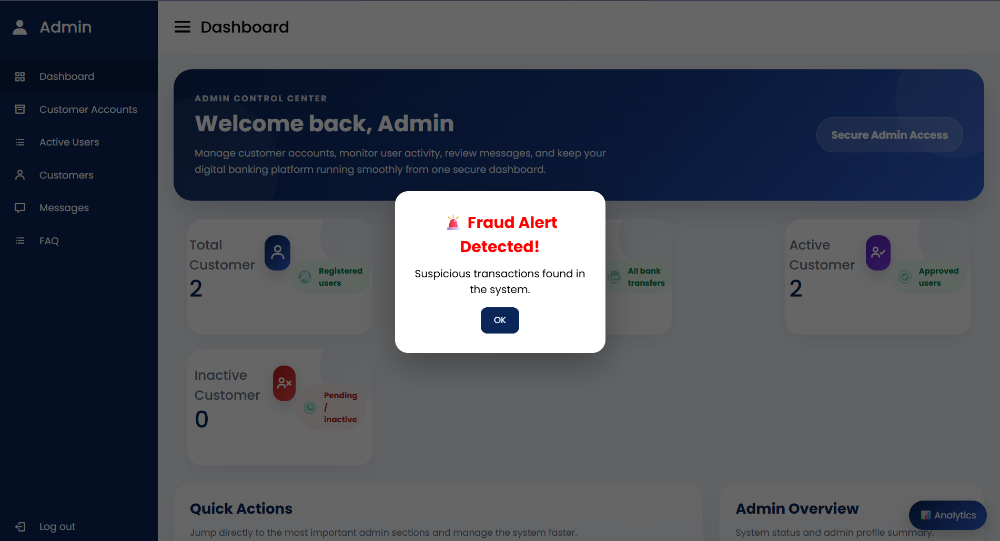

---

### Razorpay Payment Integration

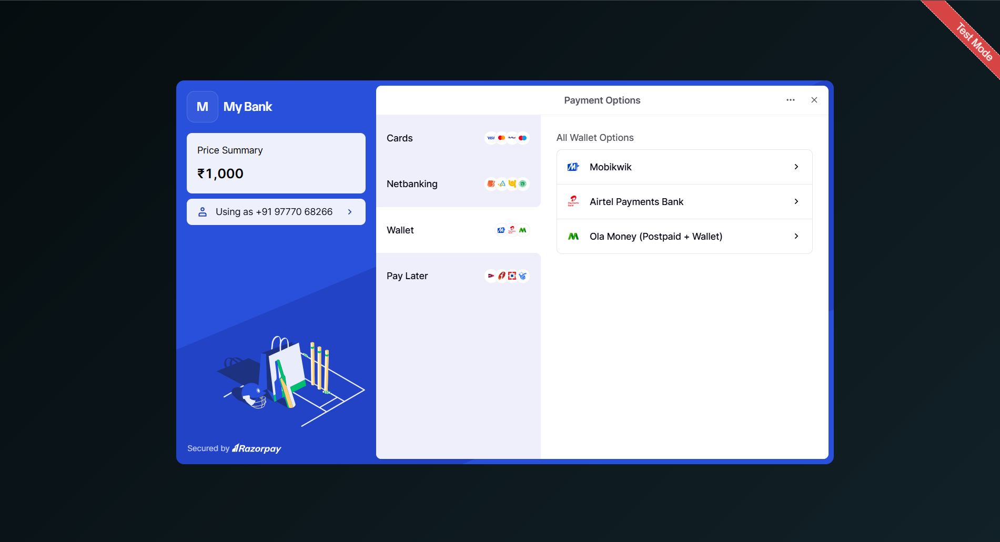

---

### Fraud Detection Dashboard

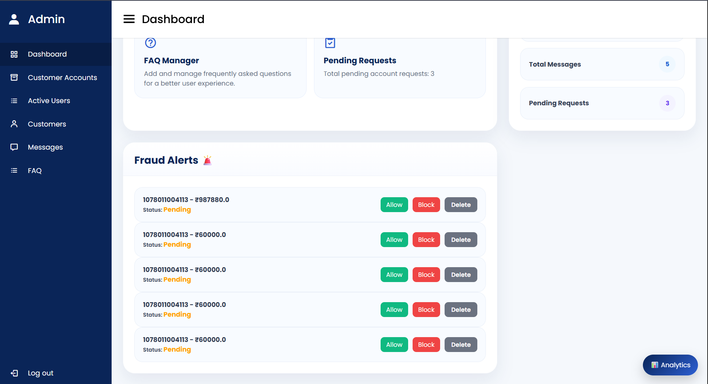

---

### Hidden Balance Front Page

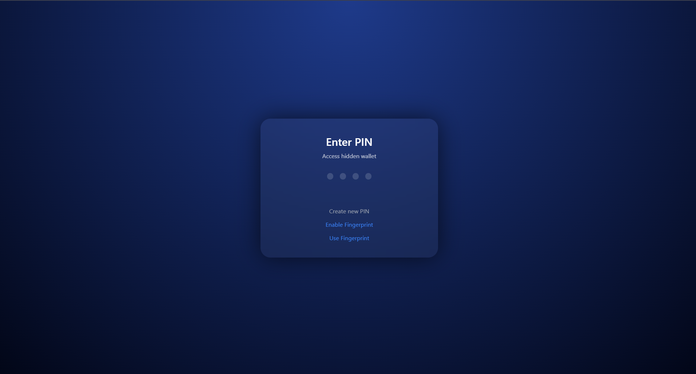

---

### Hidden Balance Vault

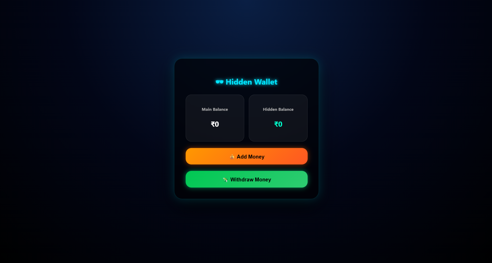

---

### Balance Check Section

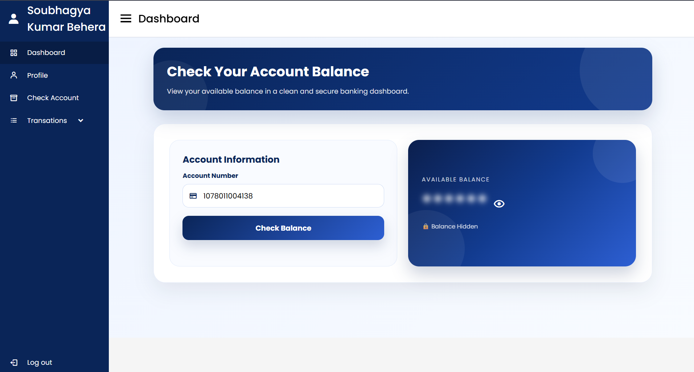

---

### Loan Application Section


---

### FAQ Management

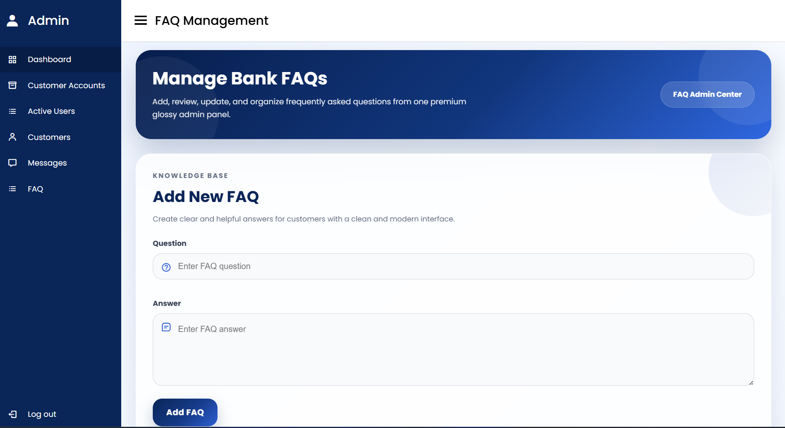

---

### Deposit Money Section

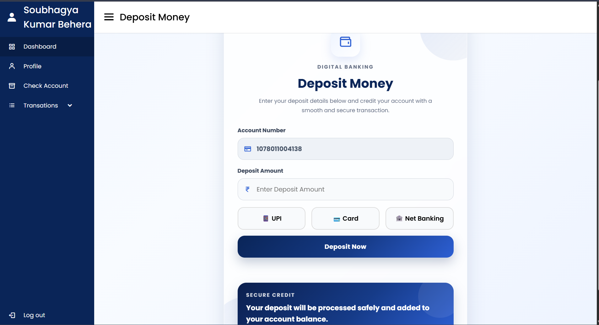

---

## 📈 Future Enhancements

- JWT Authentication
- RESTful API conversion
- React.js frontend integration
- Cloud deployment (AWS)
- AI-based fraud analytics using Machine Learning
- UPI and Net Banking integration
- Mobile application support
- Microservices architecture migration

---

## 👨‍💻 Author

### Soubhagya Behera

MCA Student | Java Full Stack Developer

- GitHub: https://github.com/soubhagya-behera
- LinkedIn: https://www.linkedin.com/in/soubhagyakumar-java

---

## ⭐ Support

If you found this project useful, consider giving it a ⭐ on GitHub.
