<div align="center">

# 🏦 Secure Digital Banking Management System

### Full-Stack Banking Operations & Financial Management Platform

A Java / Spring Boot digital banking application combining account management, authenticated transactions, loan automation, fraud monitoring, payments, PDF documentation, and customer assistance — with separate customer and admin portals.

<br/>


<br/>

**[Overview](#overview) · [Architecture](#architecture) · [Banking Flows](#banking-flows) · [Security](#security) · [Payments](#payments) · [Fraud](#fraud) · [Loans](#loans) · [Admin](#admin) · [Screenshots](#screenshots) · [Setup](#setup) · [Limitations](#limitations) · [Roadmap](#roadmap)**

</div>

---

## 📌 Overview

<table>
<tr>
<td width="50%">

**The problem**

Digital banking demos usually stop at login + CRUD. Real banking work — onboarding with approval, OTP-authorized transfers, verified payments, fraud review, EMI automation, and operations tooling — is rarely shown working together in one codebase.

</td>
<td width="50%">

**This system's approach**

A Spring MVC + JSP + JDBC monolith where a customer moves from account application → admin approval → registration → dashboard, then performs OTP-verified transfers, Razorpay TEST-mode deposits, loan/EMI operations, and hidden-balance management — while admins monitor fraud, users, FAQs, and messages.

</td>
</tr>
</table>

| Banking problem | System approach |
| --- | --- |
| Customer onboarding | Account application + input validation + admin approval |
| Unauthorized access | Session-based auth + BCrypt password hashing |
| Transaction authorization | Email OTP verification before balance mutation |
| Payment verification | Razorpay HMAC-SHA256 signature verification (TEST mode) |
| Suspicious transfers | Rule-based fraud detection + admin review queue |
| Loan lifecycle | Application + EMI tracking + scheduled deduction |
| Missed EMI | Penalty + credit-score adjustment via scheduled jobs |
| Financial records | Transfer history + mini statement + PDF certificate |
| Secondary funds | PIN-protected hidden-balance workflow |
| Customer assistance | Rule-based replies + OpenRouter AI fallback |

---

## ✨ Why this project is interesting

This is not a single-form CRUD demo. The breadth of connected workflows is the point:

- **Account lifecycle** — application with name / email / Aadhaar / PAN / mobile validation, photo upload, duplicate check, pending status, email + SMS notification, admin approval, then registration.
- **Session authentication** — BCrypt-hashed passwords, HTTP-session state, role detection routing to customer or admin dashboards.
- **OTP-gated mutations** — transfers and profile updates require email OTP verification before data changes.
- **Verified deposits** — Razorpay order creation, HMAC-SHA256 callback verification, and duplicate-payment detection by payment ID.
- **Rule-based fraud detection** — rapid-transfer and high-value-transfer rules write to a `fraud_log` table for human review.
- **Admin intervention** — approve suspicious transactions, or block them and disable the affected account.
- **Loan automation** — EMI calculation, scheduled daily deduction, overdue penalties, credit-score updates, and loan-closure flow.
- **Document generation** — loan closure certificate as a downloadable PDF via iTextPDF.
- **Hidden balance** — a secondary balance with its own PIN flow plus a browser credential / fingerprint access flow for the hidden wallet.
- **AI-assisted support** — rule-based banking intents with an OpenRouter model fallback.

> Scope note: this is a development / learning-oriented banking application. Integrations run in test / sandbox modes and credentials must be supplied via environment variables. See [Limitations](#limitations).

---

## 🧩 Feature grid

<table>
<tr>
<td width="50%" valign="top">

**🏦 Customer banking**
<br/>Account application, admin approval, registration, dashboard, balance check, profile management.

**🔐 Authentication**
<br/>BCrypt password hashing, session state, account activation checks, password-reset OTP flow.

**💸 Fund transfers**
<br/>Recipient lookup, balance checks, blocked-account guard, transfer confirmation pages.

**📩 Transaction OTP**
<br/>Sensitive transfers generate an email OTP; balances mutate only after OTP verification.

**💳 Razorpay deposits**
<br/>Server-side order creation, HMAC-SHA256 signature check, duplicate-payment guard, balance credit + confirmation email.

**🛡️ Fraud detection**
<br/>Rapid-transaction monitoring and high-value transfer flagging into a review log.

**👮 Admin fraud review**
<br/>Approve suspicious transactions, block them, or disable affected accounts.

**🤖 Banking assistant**
<br/>Rule-based intents (balance, transfer, loan, EMI, greeting) with OpenRouter AI fallback.

</td>
<td width="50%" valign="top">

**💰 Loan management**
<br/>Loan application, EMI calculation, active / closed loan views, progress tracking, manual EMI payment.

**⏰ EMI automation**
<br/>Daily 9 AM scheduled deduction plus a penalty scheduler for overdue loans.

**📉 Credit score**
<br/>Score increases on EMI payment, decreases on missed / overdue repayment events.

**📄 PDF documents**
<br/>Loan closure certificate generation with iTextPDF as a browser download.

**🔒 Hidden balance**
<br/>Move funds between main and hidden balances; dedicated hidden dashboard and deposit views.

**👆 Browser credential access**
<br/>Fingerprint / browser-credential flow for hidden-wallet access via the Credential API (see honest scope in [Security](#security)).

**📱 Responsive UI**
<br/>JSP + Bootstrap dashboards and flows that adapt to smaller screens.

**🔔 Notifications**
<br/>Gmail SMTP emails (account, OTP, EMI, loan, deposit) and Twilio SMS on account application.

</td>
</tr>
</table>

---

## 🏗️ Architecture

> Spring MVC + JSP + JDBC monolithic web application. No JPA repositories, no JWT layer, no frontend framework — controllers talk to MySQL through `JdbcTemplate` and render JSP views.

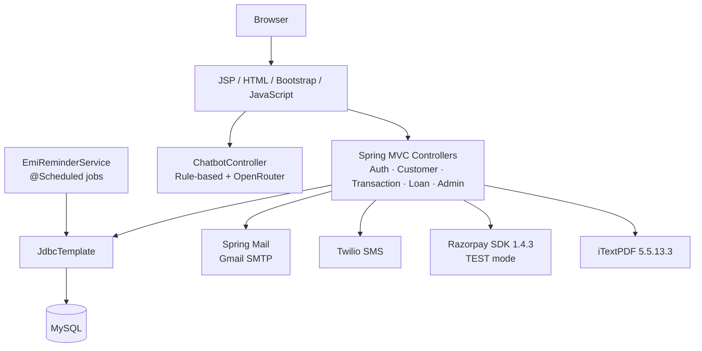
```mermaid
flowchart TB
    Browser["Browser"]
    Views["JSP / HTML / Bootstrap / JavaScript"]
    Controllers["Spring MVC Controllers<br/>Auth · Customer · Transaction · Loan · Admin"]
    Chatbot["ChatbotController<br/>Rule-based + OpenRouter"]
    Scheduler["EmiReminderService<br/>@Scheduled jobs"]
    JDBC["JdbcTemplate"]
    DB[("MySQL")]
    Mail["Spring Mail<br/>Gmail SMTP"]
    SMS["Twilio SMS"]
    Pay["Razorpay SDK 1.4.3<br/>TEST mode"]
    PDF["iTextPDF 5.5.13.3"]

    Browser --> Views
    Views --> Controllers
    Views --> Chatbot
    Controllers --> JDBC
    Scheduler --> JDBC
    JDBC --> DB
    Controllers --> Mail
    Controllers --> SMS
    Controllers --> Pay
    Controllers --> PDF
```

**Controller map**

| Controller | Responsibility |
| --- | --- |
| `AuthController.java` | Account application, registration, login / logout, password-reset OTP, contact, FAQ |
| `CustomerController.java` | Dashboard, profile + OTP-gated profile updates, balance check, withdraw page |
| `TransactionController.java` | Deposits, Razorpay flow, transfers + OTP, beneficiaries, statements, hidden wallet, PDF certificate |
| `LoanController.java` | Loan application, loan dashboard, manual EMI payment |
| `AdminController.java` | Dashboard metrics, users, fraud review, FAQ, messages |
| `ChatbotController.java` | Rule-based replies + OpenRouter fallback (`POST /chat`) |
| `EmiReminderService.java` | Scheduled EMI deduction + penalty jobs |

### Request / response workflow

```text
Browser
  ↓  HTTP request
Spring MVC Controller
  ↓  session check + input validation
JdbcTemplate
  ↓  SQL
MySQL
  ↓  rows / update counts
Model attributes
  ↓
JSP view
```

Integrations branch off the controller layer: JavaMail for email, Twilio for SMS, Razorpay SDK for deposits, OpenRouter over HTTP for the chatbot fallback, iTextPDF streaming bytes for the certificate download, and Spring `@Scheduled` jobs for EMI automation.

---

## 🔄 Banking flows

### Customer account lifecycle

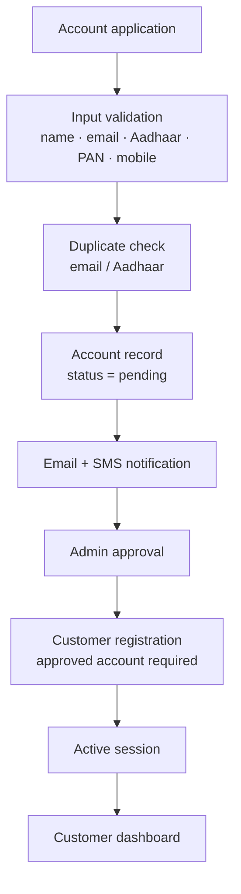
```mermaid
flowchart TB
    App["Account application"]
    Val["Input validation<br/>name · email · Aadhaar · PAN · mobile"]
    Dup["Duplicate check<br/>email / Aadhaar"]
    Rec["Account record<br/>status = pending"]
    Notify["Email + SMS notification"]
    Admin["Admin approval"]
    Reg["Customer registration<br/>approved account required"]
    Sess["Active session"]
    Dash["Customer dashboard"]

    App --> Val --> Dup --> Rec --> Notify --> Admin --> Reg --> Sess --> Dash
```

<details>
<summary><b>What the code actually enforces</b></summary>

- Name must be letters/spaces; email regex-checked; Aadhaar exactly 12 digits; PAN must match `ABCDE1234F` format; mobile must be a 10-digit Indian number starting 6–9.
- Duplicate applications are rejected when the email or Aadhaar already exists in `create_account`.
- Profile photo is stored with the application record.
- Registration requires a matching approved (`status=1`) record for account number + name + email, rejects duplicate emails, BCrypt-hashes the password, and seeds a zero `account_balance` row.

</details>

### Authentication flow

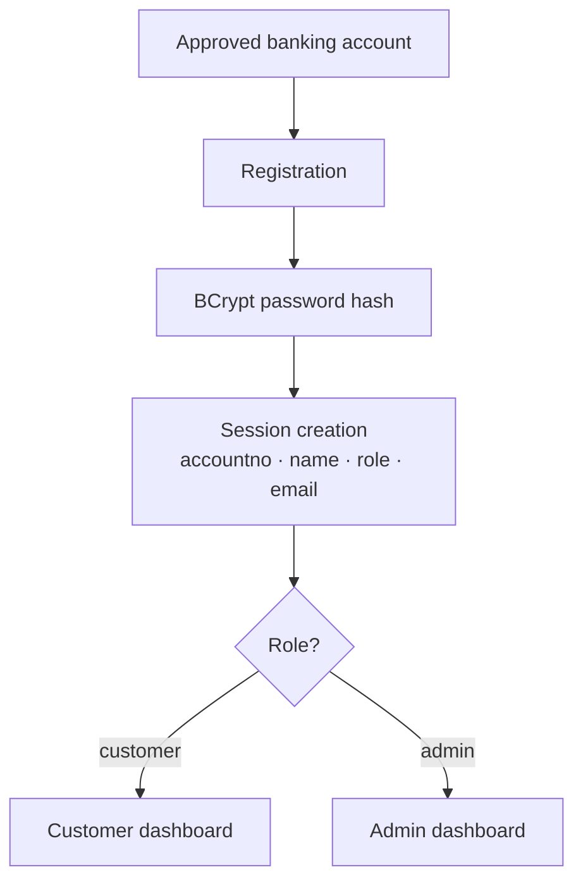
```mermaid
flowchart TB
    Acc["Approved banking account"]
    Reg["Registration"]
    Hash["BCrypt password hash"]
    Sess["Session creation<br/>accountno · name · role · email"]
    Role{"Role?"}
    Cust["Customer dashboard"]
    Adm["Admin dashboard"]

    Acc --> Reg --> Hash --> Sess --> Role
    Role -- customer --> Cust
    Role -- admin --> Adm
```

**Password recovery**

```text
Forgot Password (/forgot)
  ↓  registered email submitted
/send-reset → 6-digit OTP → session (resetOtp + resetEmail) → email
  ↓
/update-password → OTP match → new BCrypt hash stored
```

> OTPs are random 6-digit values held in HTTP-session state — simple and functional, not a dedicated cryptographic token service.

---

## 🔐 Security

Concrete mechanisms implemented in source — described as-is, without inflated claims:

| Control | Implementation |
| --- | --- |
| Password storage | BCrypt (`jbcrypt`) hashing on registration; `BCrypt.checkpw` on login |
| Authentication | HTTP-session attributes (`accountno`, `name`, `role`, `email`); inactive accounts rejected |
| Transfer authorization | Email OTP generated per transfer; debit/credit run only after OTP match |
| Profile-update authorization | Email OTP with 2-minute expiry + resend endpoint |
| Password reset | Email OTP stored in session, verified before re-hashing |
| Deposit verification | HMAC-SHA256 signature check over `order_id\|payment_id` |
| Duplicate payments | `transactions` lookup by `payment_id` before crediting |
| Fraud response | `fraud_log` review; block action disables the account (`register.status=0`) |
| Hidden wallet | Separate `hidden_balance` column + stored PIN check |
| Browser credential flow | Challenge generation + `navigator.credentials.create()` / `.get()` with server-side credential-ID comparison |

<details>
<summary><b>Browser credential / fingerprint flow — honest scope</b></summary>

The repository includes the Yubico `webauthn-server-core` 2.3.0 dependency, and the hidden-wallet page drives `navigator.credentials.create()` / `navigator.credentials.get()` with a server-issued random challenge. Registration stores the credential ID; login compares the presented credential ID against the stored one.

That is a **browser credential / fingerprint access flow for the hidden wallet** — it is not documented here as a complete cryptographic WebAuthn assertion-verification pipeline, because the verification step is a credential-ID comparison rather than full attestation / assertion signature verification.

</details>

---

## 💳 Payments

> Razorpay integration is **TEST mode / development-oriented**. Test credentials belong in environment configuration — never in the README or in committed code.

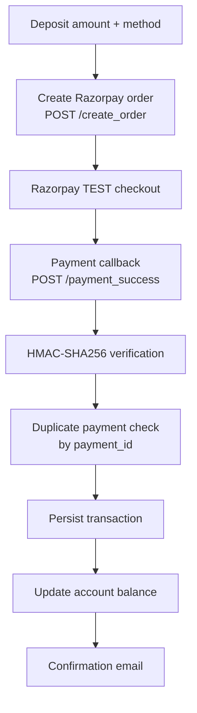
```mermaid
flowchart TB
    Amt["Deposit amount + method"]
    Order["Create Razorpay order<br/>POST /create_order"]
    Checkout["Razorpay TEST checkout"]
    Callback["Payment callback<br/>POST /payment_success"]
    Verify["HMAC-SHA256 verification"]
    Dup["Duplicate payment check<br/>by payment_id"]
    Persist["Persist transaction"]
    Credit["Update account balance"]
    Email["Confirmation email"]

    Amt --> Order --> Checkout --> Callback --> Verify --> Dup --> Persist --> Credit --> Email
```

<details>
<summary><b>How verification works in code</b></summary>

- `/deposit_money` stores the amount and payment method in the session and renders the payment page.
- `/create_order` creates a Razorpay order in INR via the Razorpay Java SDK.
- `/payment_success` recomputes `HMAC-SHA256(order_id|payment_id)` and compares it with the returned signature; mismatches are rejected.
- Before crediting, the code checks `transactions` for the same `payment_id` and rejects duplicates.
- On success it inserts the transaction, increments the balance, clears the session amount, and sends a deposit confirmation email.

</details>

---

## 🛡️ Fraud

Rule-based transfer monitoring — **rules, not machine learning**.

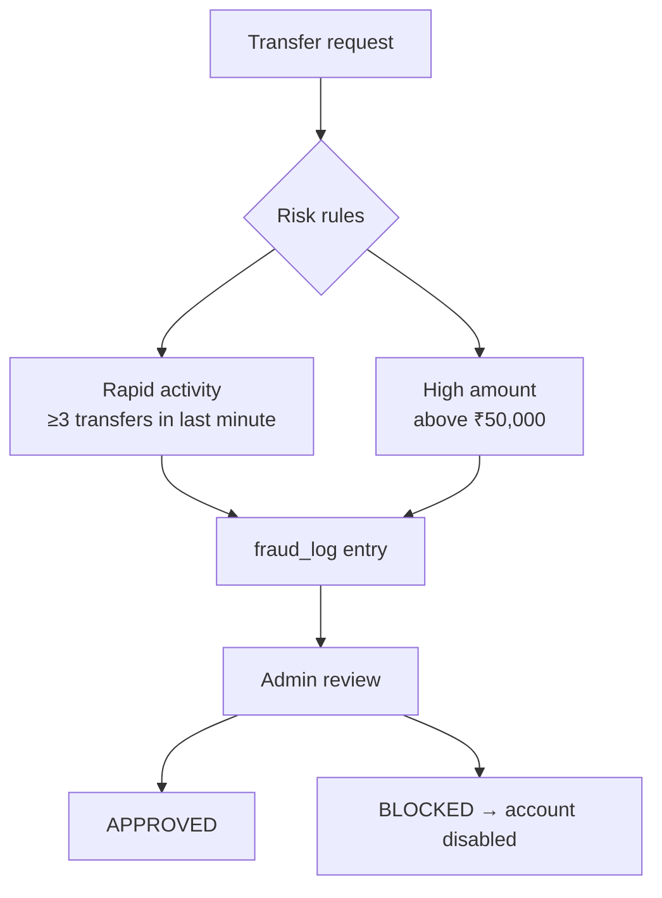
```mermaid
flowchart TB
    Req["Transfer request"]
    Rules{"Risk rules"}
    Rapid["Rapid activity<br/>≥3 transfers in last minute"]
    High["High amount<br/>above ₹50,000"]
    Log["fraud_log entry"]
    Review["Admin review"]
    Approve["APPROVED"]
    Block["BLOCKED → account disabled"]

    Req --> Rules
    Rules --> Rapid --> Log
    Rules --> High --> Log
    Log --> Review
    Review --> Approve
    Review --> Block
```

| Rule | Behavior in source |
| --- | --- |
| Rapid-transfer rule | Counts `transfer_details` rows for the sender in the last minute; at 3+, logs `"Too many transactions quickly"` and rejects the transfer |
| High-value rule | Amounts above `₹50,000` are logged as `"High amount transaction"` with a pending (`NULL`) action and held for admin approval instead of proceeding to OTP |

Admin actions (`/allowTransaction`, `/blockTransaction`, `/deleteFraud`): approve the flagged entry, mark it blocked **and** disable the account, or delete the fraud entry. The admin dashboard surfaces the 5 most recent pending alerts.

---

## 💰 Loans

| Capability | Behavior |
| --- | --- |
| Application (`/applyLoan`) | Eligibility rule: current balance must be at or below ₹100; fixed 10% interest, 6-month tenure; standard EMI formula; loan credited to balance; approval email |
| Loan dashboard | Active vs. closed loans, per-loan progress (`paid_emi / tenure`), total borrowed, open-loan count, credit score |
| Manual EMI (`/payEmi`) | Pays EMI + any penalty, resets penalty state, closes loan at full tenure, sends closure email, `+5` credit score |
| Certificate | `/downloadCertificate` streams a loan closure certificate PDF |

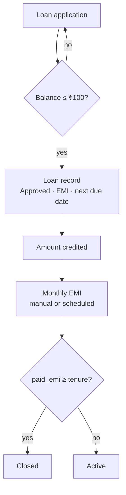
```mermaid
flowchart TB
    Apply["Loan application"]
    Elig{"Balance ≤ ₹100?"}
    Rec["Loan record<br/>Approved · EMI · next due date"]
    Credit["Amount credited"]
    EMI["Monthly EMI<br/>manual or scheduled"]
    Done{"paid_emi ≥ tenure?"}
    Closed["Closed"]
    Active["Active"]

    Apply --> Elig
    Elig -- no --> Apply
    Elig -- yes --> Rec --> Credit --> EMI --> Done
    Done -- yes --> Closed
    Done -- no --> Active
```

### ⏰ EMI automation (`EmiReminderService`)

**Daily EMI job** — cron `0 0 9 * * ?` (9 AM daily):

1. Select loans with `next_due_date = today` and `paid_emi < tenure`.
2. If balance covers EMI → deduct, increment `paid_emi`, advance `next_due_date` by one month, close loan when tenure completes, email the customer.
3. If balance is insufficient → send failure email and apply a `-50` credit-score change.

**Penalty job** — runs every 60 seconds (`fixedRate = 60000`):

1. Finds overdue loans (`next_due_date < today`, `penalty_added=0`, still open).
2. Adds a `+50` penalty, marks `penalty_added=1`, and applies a `-20` credit-score change.

---

## 🔒 Hidden balance / vault

```text
Main balance (account_balance.balance)
        ↕  /hide_money · /unhide_money
Hidden balance (account_balance.hidden_balance)
```

**Flow**

```text
Customer
  ↓  /hidden_wallet
Hidden wallet landing
  ↓  set 4-digit PIN (/setHiddenPin)
PIN verification (/verifyHiddenPin)
  ↓
Hidden dashboard (/hidden_dashboard) — main + hidden balances
  ↓  move funds in / out (/hide_money, /unhide_money)
```

Hide operations also write a `transfer_details` row (`to_account = "HIDDEN"`), so vault movements stay visible in history. Browser credential / fingerprint access (register + login options/verify endpoints) sits alongside the PIN as an alternate unlock path for the hidden wallet — scoped as described in [Security](#security).

---

## 🤖 AI banking assistant

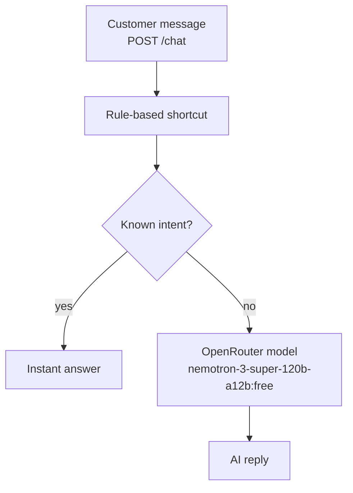
```mermaid
flowchart TB
    Msg["Customer message<br/>POST /chat"]
    Rules["Rule-based shortcut"]
    Known{"Known intent?"}
    Fast["Instant answer"]
    AI["OpenRouter model<br/>nemotron-3-super-120b-a12b:free"]
    Reply["AI reply"]

    Msg --> Rules --> Known
    Known -- yes --> Fast
    Known -- no --> AI --> Reply
```

| Input contains | Instant answer points to |
| --- | --- |
| `balance` | Check Account section |
| `transfer` | Transfer section |
| `loan` | Loan section |
| `emi` | EMI explainer |
| `hello` / `hi` | Greeting |

Anything else is forwarded to OpenRouter with a banking-assistant system prompt; failures return a graceful "busy, try again" message. The assistant gives guidance — it is **not** an authenticated financial agent and cannot move money or read account data.

---

## 📄 PDF document generation

```text
Loan record + customer name
  ↓  /downloadCertificate?loanId=…
iTextPDF Document
  ↓
Loan Closure Certificate (name, account, amount, status, date)
  ↓  Content-Disposition: attachment
Browser download (LoanCertificate.pdf)
```

---

## 👮 Admin

The admin portal (`/admindashboard` + sub-pages) is an operations console, not just a user list:

| Area | Capabilities |
| --- | --- |
| Dashboard metrics | Total / active / inactive customers, transaction count, pending account requests, message count, 5 latest pending fraud alerts |
| Customer accounts | View all applications with photos; approve / edit status via `/updateuser` |
| Active users | Filtered active non-admin account list |
| User management | `/manageuser` lookup across `register` + `create_account`; delete removes both records |
| Fraud review | Approve, block (disables account), or delete fraud entries |
| FAQ management | Add / delete FAQs served to the public `/faq` page |
| Messages | Read + delete contact-form submissions |

---

## 📸 Screenshots

> All paths verified under `assets/screenshots/`. Single-column, width-controlled gallery for desktop and mobile readability.

### Public & authentication

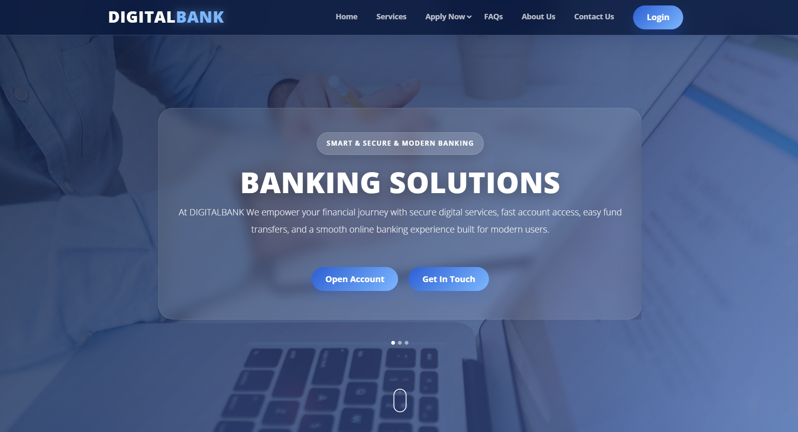

*Opening page — public landing.*


*Login — session authentication entry point.*

### Customer banking

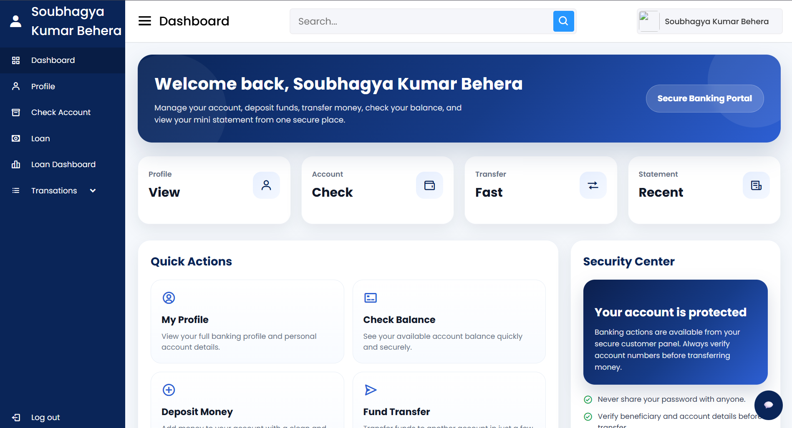

*Customer dashboard — account overview.*

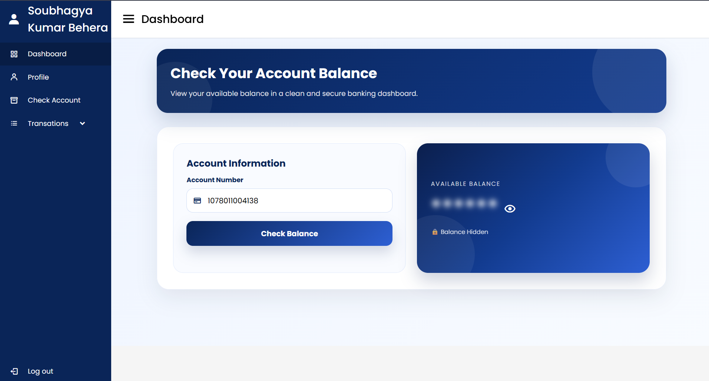

*Balance check.*

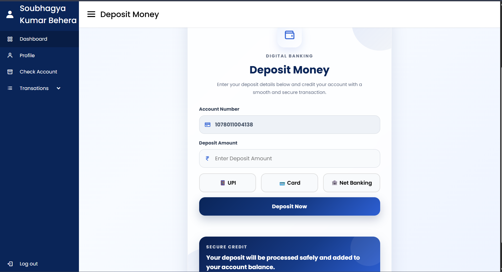

*Deposit flow entry.*

### Loans

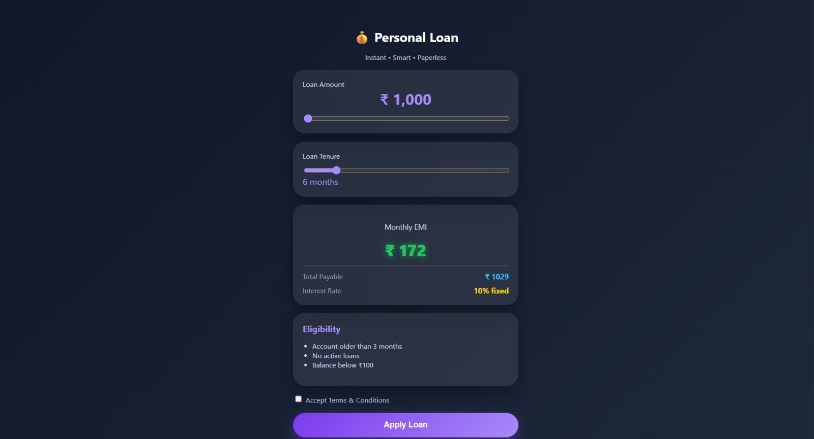

*Loan dashboard — active / closed loans, progress, credit score.*

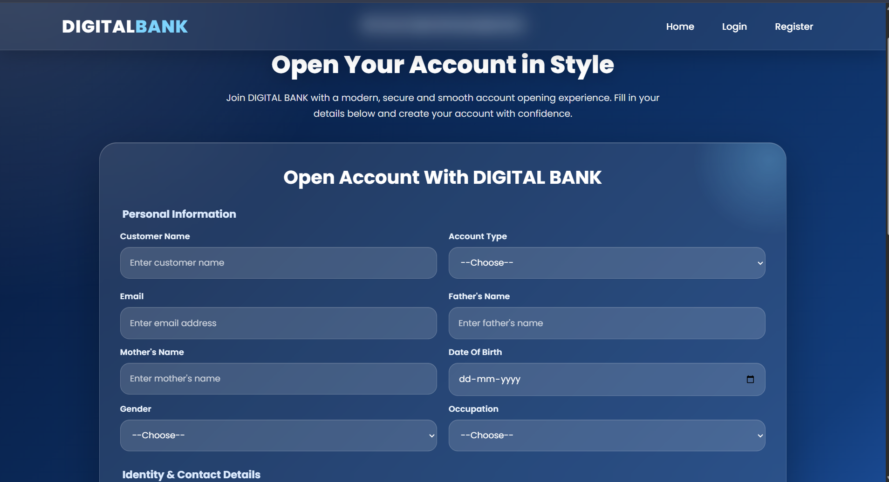

*Loan application section.*

### Payments & risk

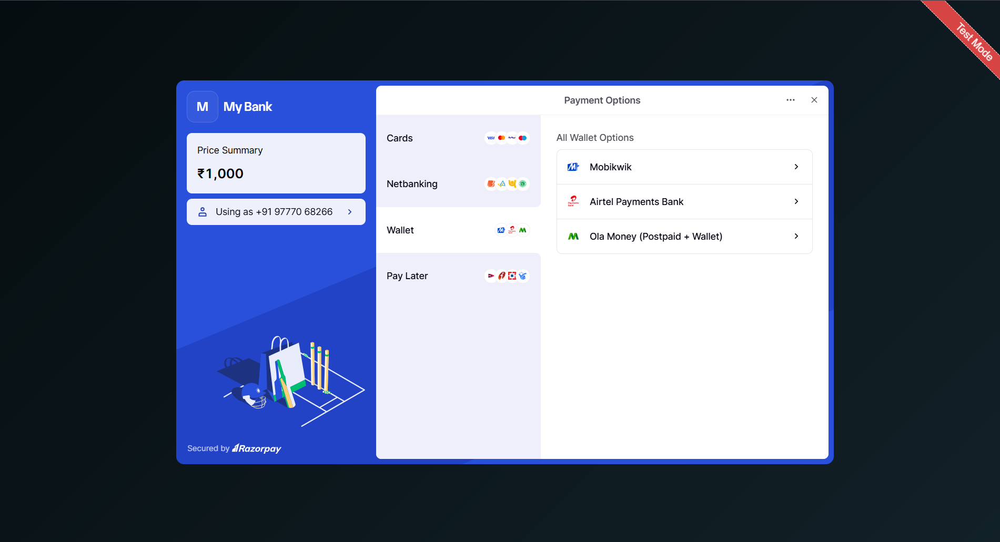

*Razorpay TEST-mode checkout.*

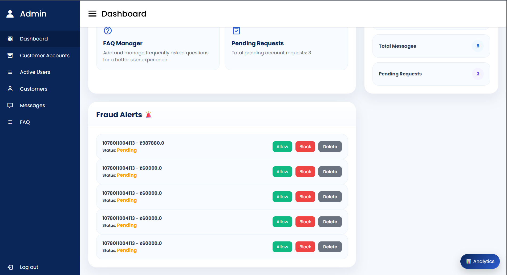

*Fraud alert review queue.*

### Hidden vault

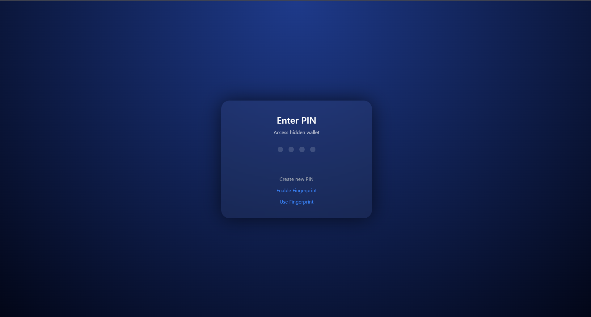

*Hidden-balance landing.*

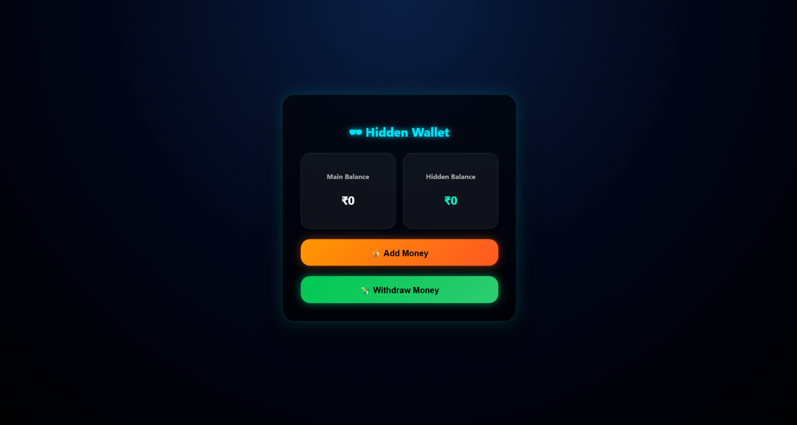

*Hidden-balance vault with PIN + browser-credential access.*

### Administration

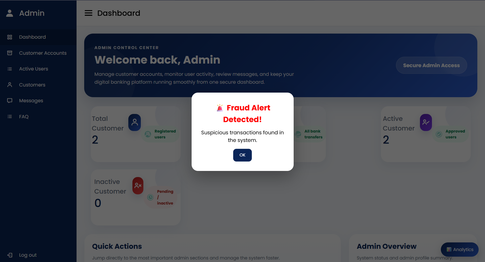

*Admin dashboard — metrics, pending requests, fraud alerts.*

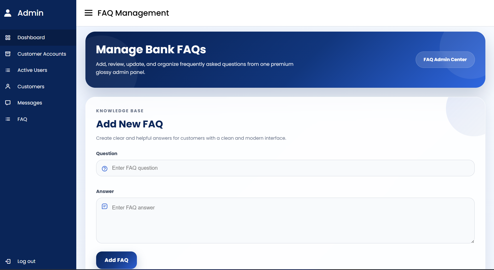

*FAQ management.*

---

## 🛠️ Technology stack

| Layer | Technologies |
| --- | --- |
| Language | Java 17 |
| Backend | Spring Boot 3.2.4, Spring MVC, Spring JDBC (`JdbcTemplate`) |
| View | JSP, JSTL, Bootstrap, JavaScript |
| Database | MySQL 8 |
| Security controls | BCrypt (`jbcrypt`), HTTP session, email-OTP workflows |
| Payments | Razorpay Java SDK 1.4.3 — TEST mode |
| Messaging | Twilio SDK 9.14.0 (SMS), Spring Mail / Gmail SMTP (email) |
| AI | OpenRouter API (rule-based first, model fallback) |
| Documents | iTextPDF 5.5.13.3 |
| Browser credential | Yubico WebAuthn dependency 2.3.0 + Credential API flow (scoped, see [Security](#security)) |
| Build | Maven (wrapper included) |
| Packaging | WAR (`SpringBootServletInitializer`) |
| Container | Docker (Maven build stage + Eclipse Temurin Java 17 runtime) |

---

## 🗂️ Project structure

```text
secure-digital-banking-management-system/
├── src/
│   └── main/
│       ├── java/
│       │   └── com/example/online_banking_system/
│       │       ├── OnlineBankingApplication.java
│       │       ├── AuthController.java
│       │       ├── CustomerController.java
│       │       ├── TransactionController.java
│       │       ├── LoanController.java
│       │       ├── AdminController.java
│       │       ├── ChatbotController.java
│       │       └── EmiReminderService.java
│       ├── resources/
│       │   └── application.properties
│       └── webapp/
│           └── WEB-INF/jsp/        # ~40 JSP views (dashboards, flows, wallet, admin)
├── assets/
│   └── screenshots/
├── Dockerfile
├── pom.xml                        # Java 17 · Spring Boot 3.2.4 · WAR
└── README.md
```

---

## ⚙️ Setup

### Prerequisites

- Java 17+
- MySQL 8+
- Maven wrapper (included — no separate install needed)
- Optional, for integrations: Gmail SMTP app credentials, Twilio account, Razorpay TEST keys, OpenRouter API key

### 1. Clone

```bash
git clone https://github.com/soubhagya-behera/secure-digital-banking-management-system.git
cd secure-digital-banking-management-system
```

### 2. Create the database

```bash
mysql -u root -p -e "CREATE DATABASE digital_banking;"
```

> Table definitions follow the queries in the controllers (`create_account`, `register`, `account_balance`, `transactions`, `transfer_details`, `beneficiary_list`, `loan_master`, `fraud_log`, `faq`, `contact_table`). Import or create them before first run.

### 3. Configure environment (no secrets in code)

`src/main/resources/application.properties` reads everything sensitive from the environment:

| Variable | Purpose |
| --- | --- |
| `PORT` | Server port (defaults to `8080`) |
| `DB_URL` | JDBC URL, e.g. `jdbc:mysql://localhost:3306/digital_banking` |
| `DB_USER` | Database user |
| `DB_PASS` | Database password |
| `MAIL_USER` | Gmail SMTP username |
| `MAIL_PASS` | Gmail SMTP app password |
| `TWILIO_SID` | Twilio account SID (used in `AuthController`) |
| `TWILIO_TOKEN` | Twilio auth token (used in `AuthController`) |
| `OPENROUTER_API_KEY` | OpenRouter key (used in `ChatbotController`) |

```bash
# example (PowerShell)
$env:DB_URL="jdbc:mysql://localhost:3306/digital_banking"
$env:DB_USER="root"
$env:DB_PASS="YOUR_DB_PASSWORD"
$env:MAIL_USER="you@example.com"
$env:MAIL_PASS="YOUR_MAIL_APP_PASSWORD"
$env:TWILIO_SID="YOUR_TWILIO_SID"
$env:TWILIO_TOKEN="YOUR_TWILIO_TOKEN"
$env:OPENROUTER_API_KEY="YOUR_OPENROUTER_API_KEY"
```

> Secret hygiene: keep test keys in environment / secret manager only. Payment credentials must never be committed — use placeholders like `YOUR_RAZORPAY_TEST_KEY` / `YOUR_RAZORPAY_TEST_SECRET` in any local config.

### 4. Run

```bash
./mvnw spring-boot:run
```

Open:

```text
http://localhost:8080
```

### 🐳 Docker

The `Dockerfile` is a two-stage build — Maven + Java 17 compiles the WAR, then an Eclipse Temurin Java 17 image runs it on port `8080`:

```text
Maven 3.9.6 + Java 17 build (mvn clean package -DskipTests)
        ↓  WAR artifact
Eclipse Temurin Java 17 runtime (java -jar app.war)
        ↓  EXPOSE 8080
```

```bash
docker build -t digital-banking .
docker run -p 8080:8080 `
  -e DB_URL="jdbc:mysql://host.docker.internal:3306/digital_banking" `
  -e DB_USER="root" `
  -e DB_PASS="YOUR_DB_PASSWORD" `
  digital-banking
```

---

## 🗺️ Route reference

> MVC/JSP route map (views + form posts), not a JSON API. All routes verified against controller source.

<details>
<summary><b>Authentication — <code>AuthController</code></b></summary>

| Route | Purpose |
| --- | --- |
| `GET /` | Landing page |
| `GET /create_account` + `POST /create_account` | Account application form + submission |
| `GET /register` + `POST /register` | Customer registration (approved accounts only) |
| `GET /login` + `POST /login` | Login, session creation, role redirect |
| `GET /logout` | Session invalidation |
| `GET /forgot` + `POST /send-reset` + `POST /update-password` | Password-reset OTP flow |
| `POST /contact` | Contact form submission |
| `GET /faq` | Public FAQ |

</details>

<details>
<summary><b>Customer — <code>CustomerController</code></b></summary>

| Route | Purpose |
| --- | --- |
| `GET /customerdashboard` | Customer dashboard |
| `GET /profile` | Profile view with photo |
| `GET /check_account` | Balance check (param or session account) |
| `GET /updateprofile` + `POST /updateprofiledata` | Edit profile → OTP issuance |
| `POST /verify-profile-otp` + `GET /resend-otp` | OTP-gated profile update |
| `GET /withdraw` | Transfer page |

</details>

<details>
<summary><b>Transactions & deposits — <code>TransactionController</code></b></summary>

| Route | Purpose |
| --- | --- |
| `GET /deposit` + `POST /deposit_money` | Deposit entry → payment page |
| `POST /create_order` | Razorpay order creation (JSON) |
| `POST /payment_success` | Signature verification + balance credit |
| `POST /transferMoney` | Transfer validation → fraud checks → OTP |
| `POST /verify-otp` | OTP verification → debit/credit + history |
| `GET /getaccountholdername` | Recipient name lookup (JSON) |
| `GET /ministatement` + `GET /transactions` | Statements |
| `GET /payment-history` | Deposit history |
| `GET /addbeneficiary` + `POST /addbeneficiary` | Beneficiary management |

</details>

<details>
<summary><b>Hidden wallet — <code>TransactionController</code></b></summary>

| Route | Purpose |
| --- | --- |
| `GET /hidden_wallet` + `GET /hidden_home` | Wallet landing pages |
| `GET /hidden_dashboard` | Main + hidden balances |
| `GET /hidden_deposit` | Vault deposit view |
| `POST /hide_money` + `POST /unhide_money` | Move funds in / out |
| `POST /setHiddenPin` + `POST /verifyHiddenPin` | Hidden-wallet PIN |
| `GET /fingerprint/register/options` + `POST /fingerprint/register/verify` | Browser-credential enrollment |
| `GET /fingerprint/login/options` + `POST /fingerprint/login/verify` | Browser-credential unlock |
| `GET /downloadCertificate` | Loan certificate PDF download |

</details>

<details>
<summary><b>Loans — <code>LoanController</code></b></summary>

| Route | Purpose |
| --- | --- |
| `GET /loan` + `POST /applyLoan` | Loan application |
| `GET /loanDashboard` | Active / closed loans, progress, credit score |
| `POST /payEmi` | Manual EMI payment |

</details>

<details>
<summary><b>Admin — <code>AdminController</code></b></summary>

| Route | Purpose |
| --- | --- |
| `GET /admindashboard` | Metrics + pending fraud alerts |
| `GET /customeraccounts` + `GET /activeusers` + `GET /customer` | User views |
| `POST /manageuser` + `POST /updateuser` | User lookup, edit, status change, delete |
| `POST /allowTransaction` + `POST /blockTransaction` + `POST /deleteFraud` | Fraud review |
| `GET /faq_admin` + `POST /addfaq` + `POST /managefaq` | FAQ management |
| `GET /message` + `POST /deletemessage` | Contact-message inbox |

</details>

<details>
<summary><b>Assistant — <code>ChatbotController</code></b></summary>

| Route | Purpose |
| --- | --- |
| `POST /chat` | Rule-based reply or OpenRouter fallback (broad CORS enabled) |

</details>

---

## 🔍 Security posture & honest limitations

**Controls in place:** BCrypt hashing, session authentication with active-status checks, OTP verification for transfers / profile updates / password reset, Razorpay HMAC-SHA256 verification, duplicate-payment detection, rule-based fraud logging, admin approve / block / disable-account actions, hidden-wallet PIN, and the browser-credential flow described above.

**Prototype limitations (stated plainly):**

- Session-based monolith; no Spring Security dependency and no JWT layer — authorization checks are manual controller code.
- OTPs use HTTP-session state with `Math.random()` generation — functional, not a dedicated token service.
- Payment credentials need externalization — keep them in environment / secret manager, never in source.
- Some financial mutations run as sequential JDBC statements without explicit transaction boundaries.
- The browser-credential flow compares credential IDs; it is not a full cryptographic assertion-verification pipeline.
- The chatbot endpoint allows broad CORS (`*`) and depends on an external AI service.
- No automated test suite is present — testing is currently manual / development-oriented.

---

## 🧪 Testing

There is currently **no automated test suite** in the repository (`mvn clean package` runs with `-DskipTests` in Docker, and no `src/test` tree is present).

- Testing is manual / development-oriented: exercise onboarding → approval → registration → login → deposit → transfer (OTP) → loan → EMI → admin review in a local MySQL environment.
- Suggested next step: add controller/service tests and integration tests around OTP verification, payment-signature checks, and EMI scheduling before any serious deployment claim.

---

## 🚀 Deployment status

**Deployment preparation (verified):** env-var-driven `application.properties` (`PORT` default `8080`), WAR packaging via `SpringBootServletInitializer`, and a two-stage `Dockerfile` exposing `8080`.

**Actually deployed:** no live production deployment is evidenced in this repository — there is no verified live URL, so none is claimed here. To deploy, build the image, inject the environment variables from [Setup](#setup), and point `DB_URL` at a managed MySQL instance.

---

## ⚠️ Limitations

- Session-based monolithic architecture; MySQL-centric setup.
- JSP frontend — no component framework, no mobile app.
- No JWT / API layer; the app serves server-rendered views.
- No automated or end-to-end test suite.
- Payments are TEST-mode only.
- Fraud detection is rule-based (rapid + high-value); no ML analytics.
- Chatbot requires an external OpenRouter key and network access.
- Browser-credential flow is scoped as documented in [Security](#security).
- Some multi-step balance mutations lack explicit DB transaction boundaries.

---

## 🗺️ Roadmap

Future work only — nothing here is already implemented:

- Spring Security modernization (filter chain, CSRF, session hardening)
- JWT / versioned API layer alongside the MVC views
- Component-framework frontend or design-system refresh
- Stronger credential verification for the hidden-wallet flow
- Explicit `@Transactional` boundaries for money movement
- Managed secret store + key rotation for payment / mail / SMS keys
- Automated tests (unit, integration, scheduled-job tests)
- Cloud deployment with migrations, observability, and backups
- Richer fraud analytics and alerting
- Event-driven notifications (async mail/SMS)
- Real payment rails / UPI integrations (replacing TEST mode)

---

## 🏅 Engineering highlights

| Challenge | Current approach |
| --- | --- |
| Authentication | Session + BCrypt, role-based dashboard routing |
| Sensitive actions | Email-OTP verification before mutation |
| Deposits | Razorpay TEST checkout + HMAC-SHA256 verification + duplicate guard |
| Fraud | Rule-based transfer monitoring + human review queue |
| Admin response | Approve / block / disable-account actions |
| Loans | EMI calculation + active/closed lifecycle + progress |
| EMI automation | Spring Scheduler (daily deduction + penalty job) |
| Credit behavior | Score adjustments on payment, missed, and overdue events |
| Documents | iTextPDF loan closure certificate |
| Customer support | Rule-based intents + OpenRouter fallback |
| Hidden funds | PIN-protected secondary balance + browser-credential flow |
| UI | JSP + Bootstrap responsive dashboards |

---

<div align="center">

**Built with Java 17 · Spring Boot 3.2.4 · JSP · MySQL · Razorpay (TEST) · Twilio · iTextPDF · Docker**

*Development-oriented banking application — integrations run in test / sandbox modes.*

⭐ If you found this useful, consider starring the repository.

</div>
